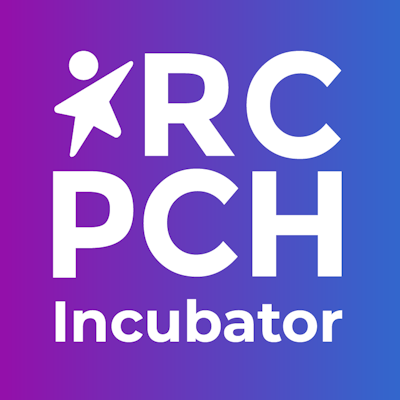
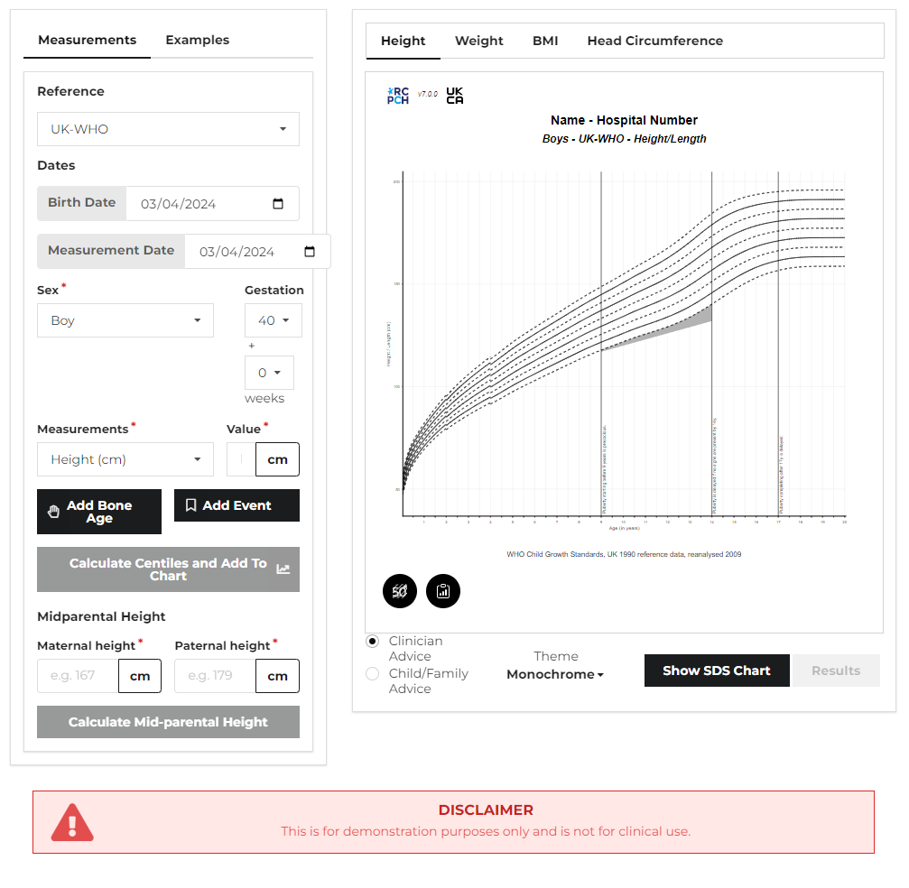
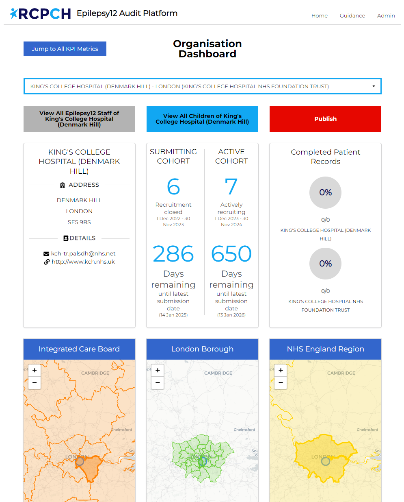

> 

> { width="100", style="vertical-align: middle;" }
> Welcome to RCPCH.Tech
> 

# Innovating the Future of Child Health with Technology & Data {style='text-align:center'}

## :health_worker: About us

### Coded by clinicians, for clinicians

We're RCPCH Tech. We are **clinicians _and_ developers** who make​ **open child health tech** you’ll want to use every day.

We merge the worlds of healthcare and technology to revolutionise child health. As the in-house development team at the [Royal College of Paediatrics and Child Health](https://www.rcpch.ac.uk/){:target="\_blank"}, we build **best practice as code**.

### Our work

We're building a portfolio that improves Paediatric care and research, from modernising digital growth charts to building apps that make large-scale audits easier. This gives us greater input into the tools we, as clinicians, use daily. Let's work together.

- **Applications:** Intuitive and user-friendly applications tailored to meet the unique needs of paediatric healthcare, including caregivers and the patient.
- **Open Source:** This is healthcare; we believe in easy-access and the power of collaboration. Explore our open-source projects and contribute to advancing child health technology worldwide: [:fontawesome-brands-github: RCPCH Github](https://github.com/rcpch){:target="\_blank"}.

## :card_index_dividers: Featured projects

Our portfolio is growing [(view all)](./portfolio.md), but here're our highlights.

### :glowing_star: Digital Growth Charts (dGC) API

<figure markdown="span">
{ width="600" style="max-height:50vw;object-fit:cover" }
<figcaption markdown="span">
Link: [https://growth.rcpch.ac.uk](https://growth.rcpch.ac.uk)
</figcaption>
</figure>
We have developed digital versions of the paper child growth charts which have been in use for decades.
They're deployed and in-use by NHS Wales, NHS Scotland, and NHS Cornwall.

### :glowing_star: Epilepsy12/Audit Engine

<figure markdown="span">
{ width="600" style="max-height:50vw;object-fit:cover" }
<figcaption markdown="span">
Link: [https://e12.rcpch.ac.uk/](https://e12.rcpch.ac.uk/)
</figcaption>
</figure>
The RCPCH Audit Engine is the data platform underlying the Epilepsy12 National Audit of Epilepsy Care. It's built  using modern methods and complies with relevant data protection protocols.

[**incubator@rcpch.ac.uk**](mailto:incubator@rcpch.ac.uk)
